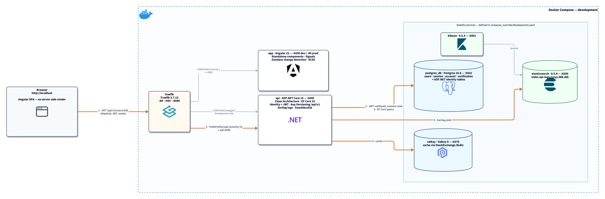

# **Modern Full Stack Architecture Starter**

A comprehensive, production-ready full-stack starter template designed for modern web development. This project serves as an excellent learning resource and starting point for developers working with cutting-edge technologies.

## **🚀 Technology Stack**

### **Frontend**
- **[Nuxt 4](https://nuxt.com/)** - The intuitive Vue framework with file-based routing
- **[Vue 3](https://vuejs.org/)** - Progressive JavaScript framework with Composition API
- **[TailwindCSS 4](https://tailwindcss.com/)** - Utility-first CSS framework, wired through `@tailwindcss/vite` in `nuxt.config.ts` (**not** `@nuxtjs/tailwindcss`, which pins Tailwind to 3.4 and has no v4 release)
- **[TypeScript](https://www.typescriptlang.org/)** - Type-safe JavaScript
- **[Pinia](https://pinia.vuejs.org/)** - Modern state management for Vue
- **[VueUse](https://vueuse.org/)** - Collection of essential Vue Composition Utilities
- **[i18n](https://i18n.nuxtjs.org/)** - Internationalization support

### **Backend**
- **[Laravel 13](https://laravel.com/)** - The PHP framework for web artisans
- **[PHP 8.5](https://www.php.net/)** - Modern PHP runtime
- **[FrankenPHP](https://frankenphp.dev/)** - Modern PHP application server (built on Caddy)
- **[Laravel Sanctum](https://laravel.com/docs/sanctum)** - API bearer-token authentication
- **[Eloquent ORM](https://laravel.com/docs/eloquent)** - Expressive database ORM with migrations
- **[Monolog](https://github.com/Seldaek/monolog)** - Structured logging, shipped to Elasticsearch
- **[Scramble](https://scramble.dedoc.co/)** - Auto-generated OpenAPI documentation for Laravel

### **Infrastructure & DevOps**
- **[Docker](https://www.docker.com/)** - Containerization platform
- **[Traefik](https://doc.traefik.io/traefik/)** - Modern reverse proxy and load balancer
- **[Valkey](https://valkey.dev/)** - High-performance in-memory data store
- **[PostgreSQL](https://www.postgresql.org/)** - Robust relational database
- **[ELK Stack](https://www.elastic.co/what-is/elk-stack)** - Elasticsearch, Logstash, Kibana for monitoring

### **Code Quality & Development**
- **[Biome](https://biomejs.dev/)** - Ultra-fast formatter and linter written in Rust
- **[TypeScript](https://www.typescriptlang.org/)** - Static type checking
- **Multi-stage Docker builds** - Optimized container images
- **Hot reloading** - Fast development experience

This setup provides a complete, production-ready foundation for modern web applications with excellent developer experience and performance.

---

## **🏗️ Architecture**



Everything sits behind **Traefik**, which routes purely by path prefix: `/` goes to the Nuxt container and `/api` to the Laravel container. Because both are served from the same origin (`http://localhost`), there is no CORS configuration anywhere in the stack.

The API is served by **FrankenPHP** — a PHP application server built on Caddy — running `php_server` against `api/public` on port 5000. There is no nginx/php-fpm split and no separate web server container.

**🟠 The numbered path** traces one example client request — an authenticated `GET /api/users/{id}`:

1. The browser sends the request with `Authorization: Bearer <token>`
2. Traefik matches `PathPrefix(/api)` and forwards it to `api:5000`
3. The `auth:sanctum` middleware resolves the token against `personal_access_tokens`
4. The controller reads the user through Eloquent and touches the Valkey cache (via predis)
5. Monolog ships a log line to Elasticsearch

The JSON response returns back along the same hops.

This is a **stateless token API**: Sanctum issues personal access tokens with a 7-day TTL, there is no `sessions` table, `SESSION_DRIVER=array`, and no CSRF cookie handshake is involved.

**🟣 The dashed purple arrow** is the one place this stack differs from a plain proxy setup. Nuxt's **Nitro server routes** (`frontend/server/api/...`) call the API container *directly* over the Docker network at `http://api:5000`, bypassing Traefik entirely — something only server-side code can do.

> **Note:** the diagram shows the **development** topology. Postgres, Valkey, Elasticsearch and Kibana are defined in `compose_override/development.yaml` only — `production.yaml` expects them to be provided externally.

> **Production build:** Nitro's `.output` is self-contained, so the frontend's production image copies only that and starts with `node .output/server/index.mjs` — it needs neither `node_modules` nor the Nuxt CLI at runtime.

Diagram source: [`docs/architecture.d2`](docs/architecture.d2). Regenerate with `./docs/render.sh` (requires [D2](https://d2lang.com)).

---

## **🚀 Quick Start**

### **Prerequisites**
- Docker and Docker Compose
- Node.js 22.19+ for local frontend development (Nuxt 4.5 requires `^22.19 || ^24.11 || >=26`; the Docker images use Node 26)
- The PHP 8.5 / Laravel backend runs in Docker — no local PHP required
- Git

### **1. Clone and Setup**
```bash
git clone <repository-url>
cd fullstack_basic_starter
```

### **2. Environment Configuration**
```bash
# Copy environment template
cp .env.placeholder .env

# Edit environment variables
nano .env
```

### **3. Start the Application**

The `start.sh` script provides a convenient way to start the application with various options:

```bash
# Start in development mode (default)
./start.sh

# Start in production mode
./start.sh -e production

# Start in development with watch mode (auto-reload on changes)
./start.sh -w

# Clean build (removes existing containers and images)
./start.sh -c

# Combine options
./start.sh -e production -c

# Show all available options
./start.sh -h
```

**Available Options:**
- `-e, --env` - Set environment (development|production) [default: development]
- `-w, --watch` - Enable watch mode for automatic reload during development
- `-c, --clean` - Clean build (removes existing containers and images before starting)
- `-h, --help` - Display help message with all options

**Manual Docker Compose:**
```bash
# Without the start.sh script
docker compose -f compose.yaml -f compose_override/development.yaml up --build
```

### **4. Initialize Database**
```bash
# Populate database with initial data
./populate.sh
```

### **5. Development Commands**
```bash
# Frontend development
cd frontend
npm run dev

# Backend (Laravel) runs in the api container; use artisan via docker exec
docker exec api php artisan migrate
docker exec api php artisan route:list

# Frontend linting and formatting (Biome)
cd frontend
npm run lint
npm run format
```

---

## **🌐 Available Services**

Once the application is running, you can access the following services:

| Service | URL | Description |
|---------|-----|-------------|
| **Frontend** | [http://localhost](http://localhost) | Nuxt 4 application with Vue 3 |
| **API** | [http://localhost/api](http://localhost/api) | Laravel REST API (Sanctum auth) |
| **API Docs** | [http://localhost/reference](http://localhost/reference) | Interactive Scramble (OpenAPI) documentation |
| **Traefik Dashboard** | [http://localhost:8080](http://localhost:8080) | Reverse proxy management interface |
| **Elasticsearch** | [http://localhost:9200](http://localhost:9200) | Search and analytics engine |
| **Kibana** | [http://localhost:5601](http://localhost:5601) | Data visualization and monitoring |

## **📁 Project Structure**

```
fullstack_basic_starter/
├── frontend/                 # Nuxt 4 frontend application
│   ├── app/                 # Vue components and pages
│   ├── stores/              # Pinia state management
│   ├── locales/             # i18n translation files
│   └── server/              # Server-side API routes
├── api/                     # Laravel backend API
│   ├── app/                 # Controllers, models, providers
│   ├── routes/              # API routes (routes/api.php)
│   ├── database/            # Eloquent migrations & seeders
│   └── config/              # Framework configuration
├── compose.yaml             # Docker Compose configuration
├── biome.json              # Biome formatter/linter configuration (frontend)
└── README.md               # This file
```

---

## **✨ Key Features**

### **Frontend Features**
- 🎨 **Modern UI** - TailwindCSS 4 with custom components, themed with CSS-first `@theme` tokens
- 🌍 **Internationalization** - Multi-language support with i18n
- 📱 **Responsive Design** - Mobile-first approach
- 🔄 **State Management** - Pinia stores for global state
- 🎯 **Type Safety** - Full TypeScript support
- ⚡ **Performance** - Optimized with Nuxt 4 features

### **Backend Features**
- 🚀 **Modern PHP** - Laravel 13 on PHP 8.5, served via FrankenPHP
- 🔐 **Authentication** - Sanctum bearer-token API auth
- 📊 **API Documentation** - Auto-generated OpenAPI via Scramble
- 🗄️ **Database ORM** - Eloquent ORM with migrations
- 📝 **Logging** - Monolog shipped to Elasticsearch
- ✅ **Validation** - Laravel request validation

### **DevOps & Quality**
- 🐳 **Containerized** - Multi-stage Docker builds
- 🔍 **Code Quality** - Biome for the frontend; PSR-12 conventions for the Laravel API
- 📈 **Monitoring** - ELK stack for observability
- 🔄 **Hot Reload** - Fast development experience
- 🛡️ **Security** - Production-ready configurations

## **🎯 Learning Opportunities**

This project is perfect for learning modern web development concepts:

1. **Database Transactions** - Implement with [Laravel database transactions](https://laravel.com/docs/database#database-transactions)
2. **Admin Dashboard** - Build a backoffice with user management
3. **Real-time Features** - Add WebSocket support
4. **Testing** - Implement unit and integration tests
5. **CI/CD** - Set up GitHub Actions workflows
6. **Advanced Auth** - OAuth providers, 2FA, etc.

## **🚀 Future Enhancements**

- [ ] **Testing Suite** - Jest/Vitest integration
- [ ] **CI/CD Pipeline** - GitHub Actions workflows
- [ ] **Real-time Features** - WebSocket support
- [ ] **Advanced Monitoring** - APM and metrics
- [ ] **Microservices** - Service decomposition
- [ ] **Cloud Deployment** - Kubernetes manifests

---

## **🛠️ Development**

### **Code Quality**
```bash
# Lint code
npm run lint

# Format code
npm run format

# Type check the frontend (there is no `type-check` script — this is the Nuxt CLI command)
cd frontend
npx nuxt typecheck
```

### **Docker Commands**

**Basic Operations:**
```bash
# Build images for development environment
docker compose -f compose.yaml -f compose_override/development.yaml build

# Start services (detached mode)
docker compose -f compose.yaml -f compose_override/development.yaml up -d

# Start services with build and watch logs
docker compose -f compose.yaml -f compose_override/development.yaml up --build

# Stop services
docker compose -f compose.yaml -f compose_override/development.yaml down

# Stop services and remove volumes
docker compose -f compose.yaml -f compose_override/development.yaml down -v
```

**Service Management:**
```bash
# Start specific service
docker compose -f compose.yaml -f compose_override/development.yaml up frontend

# Restart a specific service
docker compose -f compose.yaml -f compose_override/development.yaml restart api

# Rebuild and restart a specific service
docker compose -f compose.yaml -f compose_override/development.yaml up --build -d frontend

# Scale a service (if applicable)
docker compose -f compose.yaml -f compose_override/development.yaml up -d --scale api=3
```

**Logs and Monitoring:**
```bash
# View all logs (follow mode)
docker compose -f compose.yaml -f compose_override/development.yaml logs -f

# View logs for specific service
docker compose -f compose.yaml -f compose_override/development.yaml logs -f frontend

# View last 100 lines of logs
docker compose -f compose.yaml -f compose_override/development.yaml logs --tail=100

# View logs with timestamps
docker compose -f compose.yaml -f compose_override/development.yaml logs -f -t
```

**Debugging and Maintenance:**
```bash
# Execute command in running container
docker compose -f compose.yaml -f compose_override/development.yaml exec api sh

# List all running containers
docker compose -f compose.yaml -f compose_override/development.yaml ps

# Check service status
docker compose -f compose.yaml -f compose_override/development.yaml ps -a

# View container resource usage
docker stats

# Inspect a specific service
docker compose -f compose.yaml -f compose_override/development.yaml exec frontend npm run build
```

**Cleanup:**
```bash
# Remove stopped containers
docker compose -f compose.yaml -f compose_override/development.yaml rm

# Remove all containers, networks, and volumes
docker compose -f compose.yaml -f compose_override/development.yaml down -v --remove-orphans

# Clean up Docker system (use with caution)
docker system prune -f

# Remove all unused images
docker image prune -a

# Remove specific image
docker rmi <image_id>
```

**Production Environment:**
```bash
# Start in production mode
docker compose -f compose.yaml -f compose_override/production.yaml up --build -d

# View production logs
docker compose -f compose.yaml -f compose_override/production.yaml logs -f

# Stop production services
docker compose -f compose.yaml -f compose_override/production.yaml down
```

## **🤝 Contributing**

We welcome contributions! Here's how you can help:

1. **Fork** the repository
2. **Create** a feature branch (`git checkout -b feature/amazing-feature`)
3. **Commit** your changes (`git commit -m 'Add amazing feature'`)
4. **Push** to the branch (`git push origin feature/amazing-feature`)
5. **Open** a Pull Request

### **Development Guidelines**
- Follow the existing code style
- Add tests for new features
- Update documentation as needed
- Ensure all checks pass

## **📄 License**

This project is licensed under the **MIT License** - see the [LICENSE](LICENSE) file for details.

## **🙏 Acknowledgments**

- [Nuxt Team](https://nuxt.com/) for the amazing framework
- [Vue Team](https://vuejs.org/) for the reactive framework
- [Laravel Team](https://laravel.com/) for the elegant PHP framework
- All contributors and the open-source community

---

**⭐ Star this repository if you find it helpful!**
