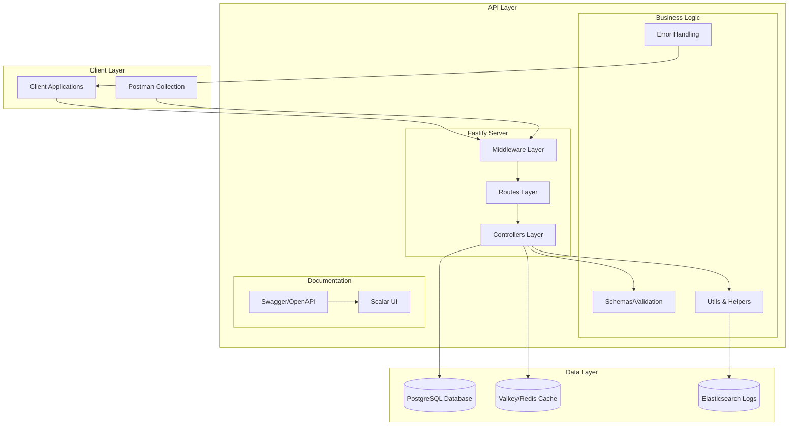
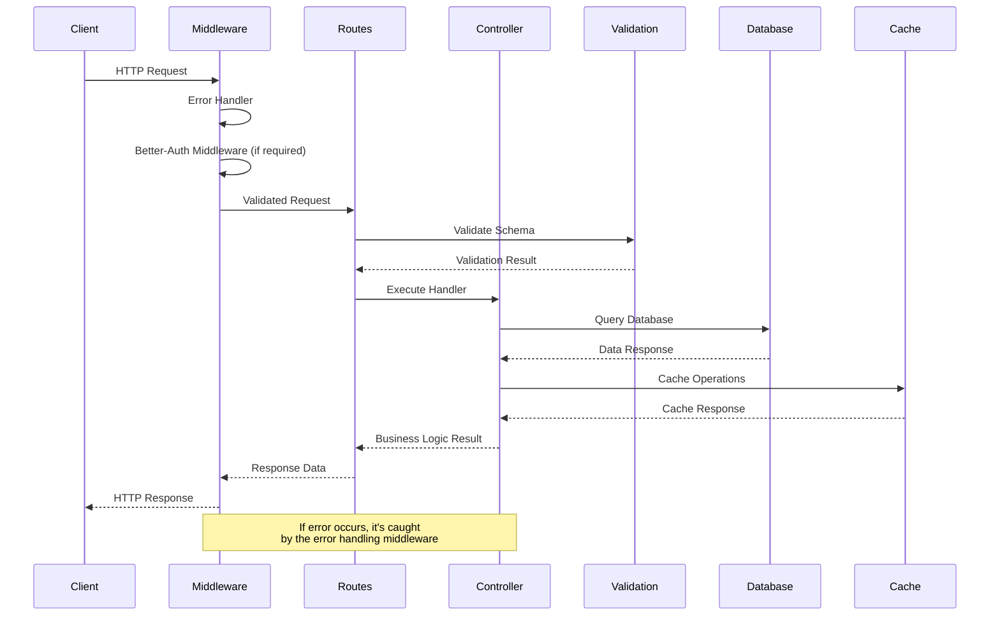
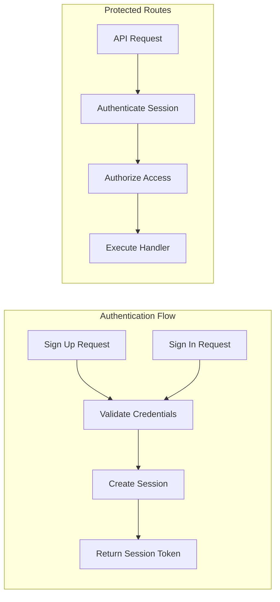
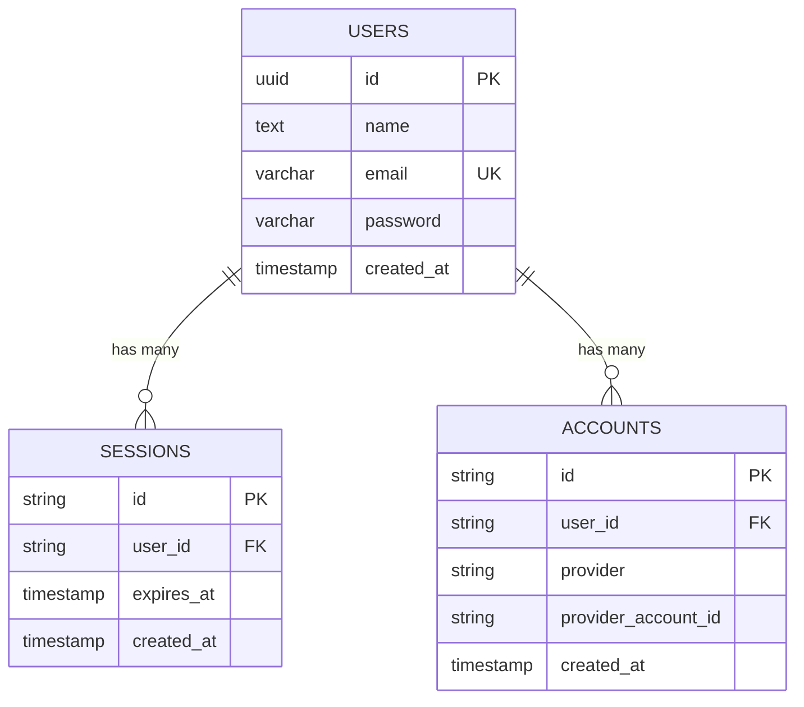
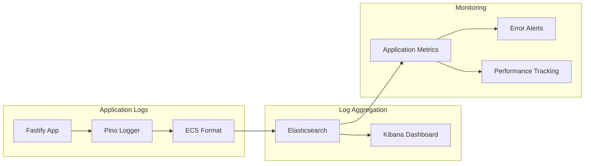

# 🚀 Fullstack Basic Starter - API

A modern REST API built with **Fastify**, **TypeScript**, **PostgreSQL**, and **Drizzle ORM**, designed to be scalable, secure, and easily maintainable.

## 📋 Table of Contents

- [🏗️ Project Architecture](#️-project-architecture)
- [🛠️ Technology Stack](#️-technology-stack)
- [📁 Project Structure](#-project-structure)
- [🔄 Request Flow](#-request-flow)
- [🔐 Authentication System](#-authentication-system)
- [🗄️ Database & Models](#️-database--models)
- [🚀 Installation & Setup](#-installation--setup)
- [📖 API Endpoints](#-api-endpoints)
- [🧪 Testing](#-testing)
- [🐳 Docker](#-docker)
- [🔧 Configuration](#-configuration)
- [📊 Logging & Monitoring](#-logging--monitoring)
- [⚡ Performance Features](#-performance-features)

## 🏗️ Project Architecture

The API follows an **MVC (Model-View-Controller)** architecture with a modular structure that clearly separates responsibilities:



## 🛠️ Technology Stack

### Core Technologies
- **[Fastify](https://fastify.dev/)** - Fast and lightweight web framework
- **[TypeScript](https://www.typescriptlang.org/)** - Type safety and better DX
- **[Drizzle ORM](https://orm.drizzle.team/)** - Type-safe ORM for PostgreSQL
- **[PostgreSQL](https://www.postgresql.org/)** - Primary relational database

### Security & Authentication
- **[Better-Auth](https://better-auth.com/)** - Modern authentication library
- **[bcrypt](https://github.com/kelektiv/node.bcrypt.js)** - Password hashing
- **[Zod](https://zod.dev/)** - Runtime data validation

### Caching & Logging
- **[Valkey](https://valkey.io/)** - In-memory cache (Redis-compatible)
- **[Pino](https://getpino.io/)** - High-performance logger
- **[Elasticsearch](https://www.elastic.co/)** - Log aggregation and search

### Development & Documentation
- **[Swagger/OpenAPI](https://swagger.io/)** - Automatic API documentation
- **[Scalar](https://scalar.com/)** - Modern API documentation UI
- **[Biome](https://biomejs.dev/)** - Code linting and formatting

## 📁 Project Structure

```
api/
├── src/
│   ├── constants/          # Application constants
│   ├── controllers/        # Business logic
│   │   ├── authController.ts
│   │   └── userController.ts
│   ├── errors/            # Error handling
│   │   └── appError.ts
│   ├── middleware/        # Custom middleware
│   │   └── errorHandler.ts
│   ├── migrations/        # Database migrations (Drizzle)
│   ├── models/           # Database models
│   │   └── user.ts
│   ├── routes/           # Route definitions
│   │   ├── authRoutes.ts
│   │   ├── testRoutes.ts
│   │   └── userRoutes.ts
│   ├── schemas/          # Zod validation schemas
│   │   ├── auth.ts
│   │   ├── common.ts
│   │   ├── transforms.ts
│   │   └── user.ts
│   ├── types/            # TypeScript definitions
│   ├── utils/            # Utility functions
│   │   ├── betterAuth.ts
│   │   ├── db.ts
│   │   ├── logger.ts
│   │   ├── schemaHelper.ts
│   │   ├── validation.ts
│   │   └── valkey.ts
│   └── app.ts           # Application entry point
├── package.json
├── tsconfig.json
├── drizzle.config.ts    # Drizzle ORM configuration
├── Dockerfile
├── Starter.postman_collection.json  # Postman test collection
└── env.d.ts            # Environment variable definitions
```

## 🔄 Request Flow

The following diagram shows how HTTP requests are processed in the API:



## 🔐 Authentication System

The API implements a **Better-Auth** based authentication system with secure session management:



### Security Components:
- **Session Management**: Secure session handling with Better-Auth
- **Bearer Token Support**: Authorization header authentication
- **Password Hashing**: bcrypt with configurable salt rounds
- **Authentication Middleware**: Automatic session verification

## 🗄️ Database & Models

The API uses **PostgreSQL** as the primary database with **Drizzle ORM** for data management:



### Database Features:
- **Type-Safe Schema**: Defined with Drizzle ORM
- **Automatic Migrations**: Managed by Drizzle Kit
- **Input Validation**: Sanitization with Zod schemas
- **Error Handling**: Centralized database error management

## 🚀 Installation & Setup

### Prerequisites
- Node.js >= 18
- PostgreSQL >= 14
- Valkey/Redis (optional, for caching)
- Elasticsearch (optional, for logging)

### Local Setup

1. **Install dependencies:**
```bash
npm install
```

2. **Configure environment variables:**
Create a `.env` file in the root directory:
```env
# Environment
ENV=development

# Database Configuration
DB_HOST=localhost
DB_USER=your_db_user
DB_PASS=your_db_password
DB_NAME=your_db_name
DB_PORT=5432

# Cache Configuration (Valkey/Redis)
VALKEY_HOST=localhost
VALKEY_PASS=your_valkey_password
VALKEY_PORT=6379

# Logging Configuration (Elasticsearch)
ELASTICSEARCH_HOST=localhost
ELASTICSEARCH_PORT=9200

# Better-Auth Configuration (Production: Use strong secrets!)
JWT_SECRET=your-super-secret-jwt-key
```

3. **Setup database:**
```bash
# Generate migrations
npm run generate

# Run migrations
npm run migrate
```

4. **Start development server:**
```bash
npm run dev
```

The server will be available at `http://localhost`

### Environment Variables Reference

| Variable | Description | Default | Required |
|----------|-------------|---------|----------|
| `ENV` | Environment mode | `development` | ✅ |
| `DB_HOST` | Database host | `localhost` | ✅ |
| `DB_USER` | Database user | - | ✅ |
| `DB_PASS` | Database password | - | ✅ |
| `DB_NAME` | Database name | - | ✅ |
| `DB_PORT` | Database port | `5432` | ✅ |
| `VALKEY_HOST` | Cache host | `localhost` | ❌ |
| `VALKEY_PASS` | Cache password | - | ❌ |
| `VALKEY_PORT` | Cache port | `6379` | ❌ |
| `ELASTICSEARCH_HOST` | Elasticsearch host | `localhost` | ❌ |
| `ELASTICSEARCH_PORT` | Elasticsearch port | `9200` | ❌ |

## 📖 API Endpoints

### 🔐 Authentication

| Method | Endpoint | Description | Auth Required | Body Schema |
|--------|----------|-------------|---------------|-------------|
| `POST` | `/api/auth/sign-up/email` | Sign up with email | ❌ | `{ email, password, name }` |
| `POST` | `/api/auth/sign-in/email` | Sign in with email | ❌ | `{ email, password }` |
| `GET` | `/api/auth/session` | Get current session | ✅ | - |
| `POST` | `/api/auth/sign-out` | Sign out | ✅ | - |
| `GET` | `/api/profile` | Get current user profile | ✅ | - |

### 👤 Users

| Method | Endpoint | Description | Auth Required | Body Schema |
|--------|----------|-------------|---------------|-------------|
| `GET` | `/api/users/:id` | Get user details | ✅ | - |
| `POST` | `/api/users` | Create new user | ❌ | `{ name, email, password }` |

### 🧪 Testing & Health Checks

| Method | Endpoint | Description | Auth Required | Body Schema |
|--------|----------|-------------|---------------|-------------|
| `GET` | `/api/healthcheck/ping` | Health check & cache test | ❌ | - |
| `POST` | `/api/identity-count` | Test endpoint for Redux | ❌ | `{ amount }` |

### 📚 Documentation

- **Scalar API Reference**: `http://localhost/reference`

## 🧪 Testing

### Postman Collection

The API includes a comprehensive Postman collection (`Starter.postman_collection.json`) with pre-configured requests for:

- **Authentication Flow**: Sign up, sign in, session management, profile access
- **User Management**: Create user, get user details  
- **Health Checks**: Ping endpoint, cache testing
- **Error Scenarios**: Invalid credentials, unauthenticated access

### Import Postman Collection

1. Open Postman
2. Click "Import" 
3. Select `api/Starter.postman_collection.json`
4. Update the base URL if needed (default: `http://localhost`)

### Manual Testing

```bash
# Health check
curl http://localhost/api/healthcheck/ping

# Create user
curl -X POST http://localhost/api/users \
  -H "Content-Type: application/json" \
  -d '{"name":"Test User","email":"test@example.com","password":"testpass"}'

# Sign in with Better-Auth
curl -X POST http://localhost/api/auth/sign-in/email \
  -H "Content-Type: application/json" \
  -d '{"email":"test@example.com","password":"testpass"}'

# Access protected route
curl -X GET http://localhost/api/profile \
  -H "Authorization: Bearer YOUR_ACCESS_TOKEN"
```

## 🐳 Docker

### Build the image:
```bash
docker build -t api-server .
```

### Run container:
```bash
docker run -p 5000 \
  -e DB_HOST=your_db_host \
  -e DB_USER=your_db_user \
  -e DB_PASS=your_db_password \
  -e DB_NAME=your_db_name \
  api-server
```

### Docker Compose (Recommended)

The project includes Docker Compose configuration for the full stack. See the root `README.md` for complete setup instructions.

## 🔧 Configuration

### Available NPM Scripts

```bash
# Development
npm run dev          # Start server with hot-reload

# Database
npm run generate     # Generate Drizzle migrations
npm run migrate      # Run database migrations

# Code Quality
npm run check        # Check and fix code with Biome
npm run format       # Format code
npm run lint         # Lint code
```

### Fastify Configuration

The Fastify server is configured with:
- **Logger**: Pino for structured logging
- **Swagger**: Automatic API documentation
- **Better-Auth Integration**: Session and authentication management
- **Error Handler**: Centralized error handling
- **CORS**: Cross-origin request configuration

### Performance Settings

- **Connection pooling**: Automatic database connection management
- **Request validation**: Schema-based validation with Zod
- **Response caching**: Valkey/Redis for session and data caching
- **Compression**: Automatic response compression

## 📊 Logging & Monitoring

### Logging System



### Logging Features:
- **Structured Logging**: ECS (Elastic Common Schema) format
- **Performance Tracking**: Request response times
- **Error Tracking**: Stack traces and error context
- **Request Tracing**: Unique IDs for request tracking
- **Security Logging**: Authentication and authorization events

## ⚡ Performance Features

### Caching Strategy
- **Session Storage**: Refresh tokens in Valkey/Redis
- **Query Caching**: Configurable database query caching
- **Response Caching**: API response caching for static data

### Database Optimization
- **Connection Pooling**: Efficient database connections
- **Query Optimization**: Drizzle ORM optimized queries
- **Index Management**: Proper database indexing

### Security Optimizations
- **Rate Limiting**: Configurable request rate limiting
- **Input Sanitization**: Automatic input cleaning
- **SQL Injection Prevention**: Parameterized queries

### Health Check Endpoints

Use these endpoints to verify system health:
- `GET /api/healthcheck/ping` - Basic health + cache test
- Database connectivity is tested on server startup

---

## 🤝 Contributing

1. Fork the project
2. Create a feature branch (`git checkout -b feature/amazing-feature`)
3. Commit your changes (`git commit -m 'Add some amazing feature'`)
4. Push to the branch (`git push origin feature/amazing-feature`)
5. Open a Pull Request

### Development Guidelines

- Follow TypeScript best practices
- Add tests for new features
- Update documentation for API changes
- Use conventional commit messages
- Ensure all linting passes before submitting

## 📄 License

This project is distributed under the ISC License. See the `LICENSE` file for more details.

---

## 🔗 Related Projects

This API is part of a full-stack starter project:
- **Frontend**: Next.js application with TypeScript and TailwindCSS
- **Database**: PostgreSQL with automated migrations
- **Infrastructure**: Docker, Traefik, and monitoring stack

---

*This README provides a comprehensive overview of the API architecture and functionality. For specific questions or support, consult the integrated API documentation or open an issue.* 